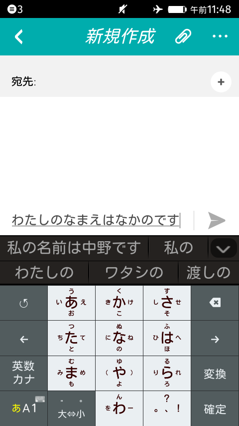

## iWnn IME for Firefox OS 試用版

このパッケージには Firefox OS の開発者向けにオムロンソフトウェア社から提供頂いた iWnn IME for Firefox OS 試用版と Firefox OS の開発端末 Flame にインストールするためのスクリプト一式が含まれています。

この iWnn IME は開発者向けの試用版であり、ユーザサポートはありません。また、試用期限は 2015 年 9 月 30 日までとなっており、それ以降はご利用頂けません。

Flame にインストールするには以下の手順に従ってください。

## USB ドライバのインストール (Windows のみ)

Windows では Flame を接続するために USB ドライバのインストールが必要になります。 [Windows のドライバ](http://cds.w5v8t3u9.hwcdn.net/Alcatel_USB_Driver_Q_4.0.0_2013_11_11_noinstall.zip) をダウンロード、インストールしてから Flame を PC に接続してください。アップデートには adb や fastboot などのコマンドが必要になります。[Android SDK](https://developer.android.com/sdk/) をインストールされるか、このパッケージに同梱されている adb.exe や fastboot.exe をご利用ください。

## Flame のソフトウェアをアップデート

まずは Flame の製造元が提供する最新安定版である Firefox OS 2.0 のベースイメージにソフトウェアアップデートを行ってください。

Flame のインターネット接続を有効にして「Setting → Device information → System Updates」で「Check for updates」をタップすると「A new firmware is available now.」というメッセージや「Update information」が表示されるので「Download」ボタンをタップしてシステムアップデートをダウンロード、「Install」ボタンをタップすると端末が再起動されることやインストール前にバックアップを推奨するメッセージが表示されます。「Continue」をタップすると端末が再起動、新しい Firefox OS に書き換えられて再起動します。

Firefox OS 2.0 ではデフォルトのホーム画面が縦スクロールになるなど操作性が大きく代わるため初回起動時には「Start your phone tour!」と書かれた操作説明ツアー画面が表示されます。ツアーを終了して「Setting → Device information → More Information」で OS version が 2.0.0.0-prerelease、Build Identifier が 20141016183911 となっていることを確認してください。

ここで説明したソフトウェアアップデートはネットワーク経由 (OTA) ではなく手動で行うこともできます。既に初期出荷時のビルド以外に書き換えているなどの理由があり手動で行いたい場合、Flame 開発元が提供する [Firefox OS 2.0 のベースイメージ (v188版)](http://cds.w5v8t3u9.hwcdn.net/v188.zip) に入れ替えてください。最新ベースイメージへのリンクやアップデート手順の詳細は [Flame の開発者向け情報ページ](https://developer.mozilla.org/ja/Firefox_OS/Developer_phone_guide/Flame) をご覧ください。

## USB 経由のデバッグを有効化

環境設定で USB 経由のデバッグを有効化してください。

「Setting → Device information → More Information」で「Developer Menu」にチェックを入れ、「Settings → Developer → Debugging via USB」で「ADB and DevTools」を選択してください。

USB ケーブルを接続したら adb devices コマンドで次のように接続した端末の device id が出力されることを確認してください:

```
  List of devices attached 
  f296d820    device
```

## Flame を Nightly ビルドに更新

[Flame の開発者向け情報ページ](https://developer.mozilla.org/ja/Firefox_OS/Developer_phone_guide/Flame) に記載の手順に従って、Mozilla が提供する Firefox OS の Nightly ビルドのうち、[Production Builds の Release Build](http://ftp.mozilla.org/pub/mozilla.org/b2g/nightly/latest-mozilla-b2g32_v2_0-flame-kk/) に更新してください。

gaia.zip, b2g-XX.XX.en-US.android-arm.tar.gz をダウンロードしたら、Windows では [shallow_flash.bat スクリプト](https://raw.githubusercontent.com/Mozilla-TWQA/B2G-flash-tool/master/shallow_flash.bat) をダブルクリックしてください。Mac や Linux では [shallow_flash.sh スクリプト](https://github.com/Mozilla-TWQA/B2G-flash-tool/blob/master/shallow_flash.sh) を使ってビルドの書き換えを行ってください。

```
./shallow_flash.sh -g gaia.zip -G b2g-XX.XX.en-US.android-arm.tar.gz
```

note: Firefox OS の UI は英語のままで使用する場合この手順は不要です。

## USB 経由のデバッグを有効化

Nightly ビルドにアップデートして Flame が再起動したら、日本語を選択して初期セットアップを完了し、環境設定で USB 経由のデバッグを有効化します。

「環境設定 → 端末情報 → その他の情報」で「開発者メニュー」にチェックを入れ、「環境設定 → 開発者 → USB経由のデバッグ」で「ADBと開発ツール」を選択して有効化したら、先ほどと同様に adb devices で接続できることを確認してください。

## iWnnServer を Flame にインストール

このパッケージに同梱されているインストールコマンドを実行してください。Windows では install.bat、Mac では install.sh になります。Flame 端末に iWnnServer がインストールされ端末が再起動します。

## Firefox で WebIDE をセットアップ

Firefox OS のアプリ開発環境 WebIDE をセットアップします。

Firefox 33 以前では WebIDE は標準では有効化されていないため、アドレスバーに "about:config" と入力してブラウザの設定画面を開き、検索フィールドに "webide" と入力して設定項目を絞り込み、"devtools.webide.enabled" が false となっているのをダブルクリックして true に変更してください。

Shift+F8 または「Web開発メニュー → WebIDE」で WebIDE を起動したら「ランタイムを選択 → USB デバイス → ADB Helper をインストール」で表示される追加のコンポーネント管理画面で「ADB Helper アドオン」をインストールしてください。Firefox OS の各バージョンのシュミレータもここでインストールできます。

## iWnn IME キーボードを Flame にインストール

Firefox の WebIDE で「ランタイムを選択 → USB デバイス → Flame」を選択して端末と接続してください。環境によってはここで "Flame" ではなく "f296d820" のような一件ランダムな ID で認識されることもあります。

Flame 端末で「リモートデバッグの接続許可を求められています。接続を許可しますか？」のように表示されたら「OK」をタップして接続を許可してください。

WebIDE で「アプリを開く → パッケージ型アプリを開く」でこのパッケージに含まれる keyboard-iwnn ディレクトリを選択して開いたら、WebIDE 上部のインストールして実行ボタン (右向き三角形のボタン) をクリックしてください。

Flame 端末で「iWnn IME のインストールが完了しました」と表示されるので「セットアップ」をタップして、キーボードの追加確認画面で「日本語」にチェックを入れて「確認」をタップしてください。ここでキーボードを追加しなかった場合もあとで「環境設定 → キーボード → 使用中のキーボード → 他のキーボードを追加 → iWnn IME → 日本語」のチェックを入れることで追加できます。


## キーボードを iWnn IME に切り替えて日本語入力をする

アプリケーションで文字入力をする際にキーボードが表示されますが、Firefox OS 標準の英語キーボードが表示されている場合、キーボード最下段の「En...」と書かれたボタンをタップすることで iWnn IEM に切り替えられます。

iWnn IME では日本語だけでなく英語や数字入力用のキーボードもテンキーとフルキー両方が搭載されているため、標準の英語や数字のキーボードは不要になります。iWnn IME だけを利用したい場合は「環境設定 → キーボード → 使用中のキーボード」で標準のキーボードの「Number」や「English」のチェックを外し、iWnn IME の「日本語」だけにチェックを入れてください。

iWnn IME の設定変更やユーザ辞書の管理は「環境設定 → キーボード → iWnn IME」でできます。

  
